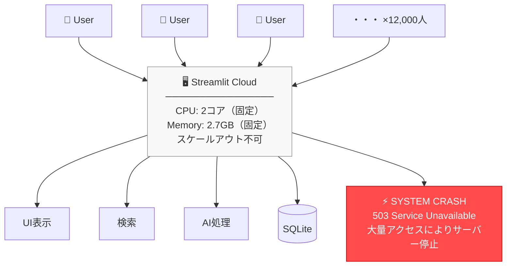
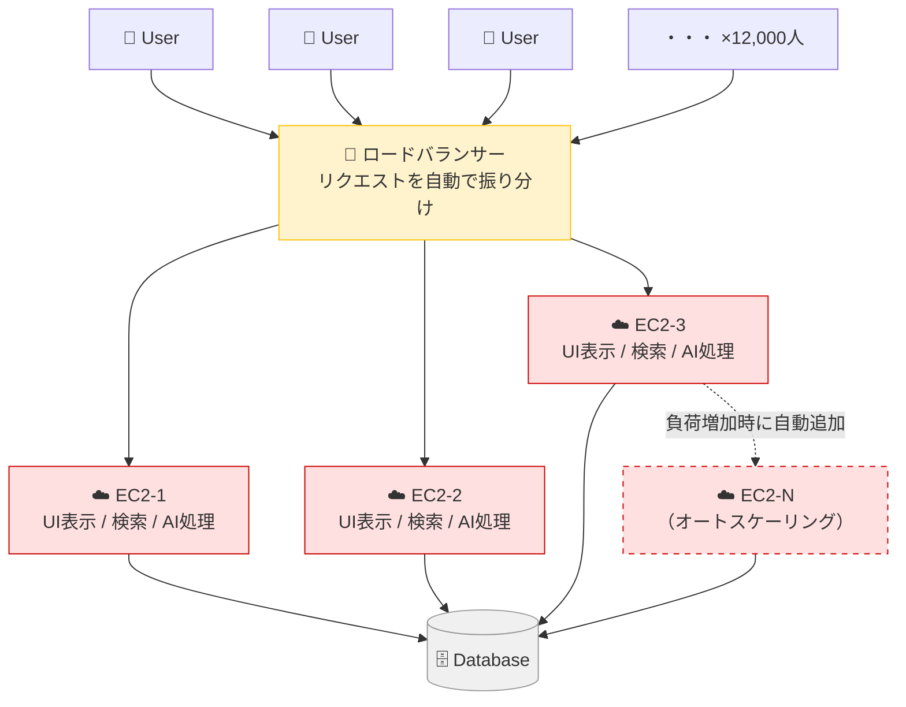
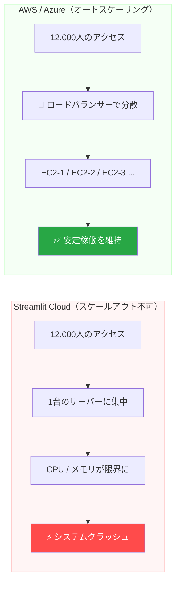
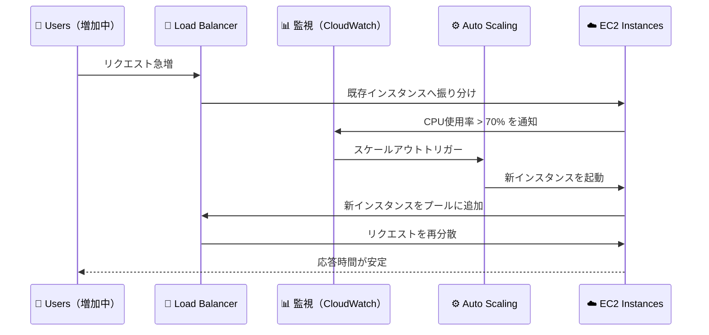

# アーキテクチャ図生成プロンプト集

Mermaid（GitHub上でそのまま描画可能）と、AI画像生成ツール向けプロンプトを掲載しています。

---

## 1. Mermaid 図（GitHubで直接レンダリング可能）

### 1-1. Streamlit Cloud アーキテクチャ（単一サーバー構成）



---

### 1-2. AWS / Azure アーキテクチャ（ロードバランサー + オートスケーリング）



---

### 1-3. Streamlit Cloud vs AWS / Azure 比較フロー



---

### 1-4. オートスケーリングのシーケンス



---

## 2. AI 画像生成プロンプト

ChatGPT（DALL-E）や Midjourney、Stable Diffusion などに貼り付けて使用してください。

### 2-1. Streamlit Cloud（過負荷・クラッシュ）

```
A technical architecture diagram showing a single-server system under heavy load.
12,000 user icons on the left all connected by red arrows to one server box labeled "Streamlit Cloud".
The server box shows CPU at 100% with a warning bar.
A large red explosion icon labeled "SYSTEM CRASH / 503 Service Unavailable" appears next to the server.
Clean, flat design with white background. Infographic style.
```

### 2-2. AWS / Azure（ロードバランサー + オートスケーリング）

```
A technical architecture diagram showing a scalable cloud system.
12,000 user icons on the left sending arrows to a central yellow box labeled "Load Balancer".
From the Load Balancer, arrows point to three pink server boxes labeled "EC2-1", "EC2-2", "EC2-3",
each containing icons for UI, Search, and AI processing.
A dashed arrow indicates a fourth server being added automatically (labeled "Auto Scaling").
All servers connect to a shared database icon at the bottom.
Green checkmark and "Stable" label. Clean flat infographic style, white background.
```

### 2-3. 左右比較図（Streamlit Cloud vs AWS / Azure）

```
A side-by-side technical comparison diagram.
Left side labeled "Streamlit Cloud": users sending requests to one server, which crashes with a red explosion icon.
Right side labeled "AWS / Azure": users sending requests to a load balancer, which distributes to multiple servers, all stable with green checkmarks.
Blue arrows for normal flow, red arrows for overload.
Clean flat design, white background, suitable for a presentation slide.
```

---

## 3. draw.io / Lucidchart 向け構成メモ

手動でダイアグラムツールを使う場合の構成要素メモです。

### Streamlit Cloud 構成
- **図形**: ユーザーアイコン × 3〜5個（+「×12,000」テキスト）
- **矢印**: ユーザー → サーバー（赤・太線）
- **サーバーボックス**: 1つ（CPU/メモリ仕様を記載）
- **内部レイヤー**: UI表示 / 検索 / AI処理 / SQLite
- **クラッシュ表示**: 赤背景の「⚡ SYSTEM CRASH」ボックス

### AWS / Azure 構成
- **図形**: ユーザーアイコン × 3〜5個（+「×12,000」テキスト）
- **ロードバランサー**: 黄色ボックス（中央配置）
- **EC2インスタンス**: 3〜4つ（並列配置、ピンク背景）
- **内部レイヤー**: UI表示 / 検索 / AI処理（各インスタンスに）
- **オートスケール表示**: 点線ボックスで追加インスタンスを表現
- **データベース**: 下部に共有DB（シリンダーアイコン）
